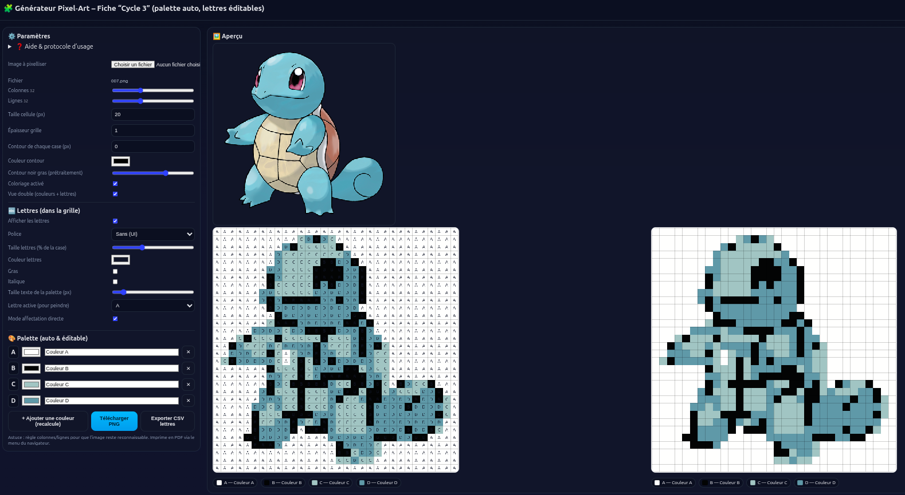

# Générateur Pixel-Art – Fiche « Cycle 3 » (Maths974)

[](https://USER.github.io/pixel-art-c3/)
[](LICENSE)

**Démo en ligne : [Démo](https://github.com/rodeofly/pixelmap974/pixelmap974.html)**

Un générateur 100% front (HTML/JS/CSS) pour fabriquer des fiches **Pixel-Art pédagogiques** (Cycle 3) : quantification d’image, palette automatique, prétraitement des **contours noirs**, édition des lettres en grille, export **PNG** et **CSV**.



---

## ✨ Fonctionnalités

- **Pixelisation** d’une image avec grille **colonnes/lignes** réglables.
- **Palette auto** (k-means déterministe) : ajouter/supprimer une couleur → **re-calcule toute la palette** et **réaffecte** les cases.
- **Prétraitement “contours noirs”** sur l’image **d’origine** (avant pixelisation).
- **Stabilité** : “Relancer la pixelisation” → résultat **identique** à paramètres égaux.
- **Édition directe** : clique une case pour lui affecter la **lettre active** → couleur mise à jour immédiate.
- **Polices** (liste de styles très distincts) + **taille du texte** (grille et palette).
- **Mode coloriage** (couleurs ON/OFF pour les exercices), **vue double** (couleurs + lettres).
- **Exports** : image **PNG** (vue simple/double) & **CSV** des lettres.  
- **Self-tests** (console) pour valider les utilitaires & le pipeline.

---

## 🚀 Utilisation

### En ligne
- Ouvre la **démo** : **https://github.com/rodeofly/pixelmap974/pixelmap974.html**

### En local
- Ouvre simplement `index.html` dans le navigateur  
  ou lance un mini serveur HTTP :
  ```bash
  npx serve .
  # ou
  npx http-server .
